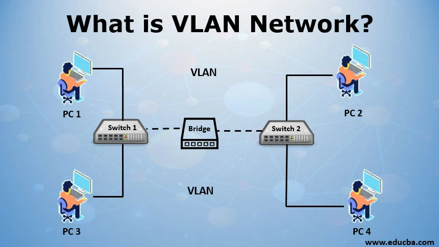

# SMX2-M12.2-PJ-Sintesi-Fase4-A06---Joel-Terol-Roberto-Feliu-Mart-Urpinas

# Classificació IP's 

Las IPs se classifican en diversas clases según su función o su rango.

|Clase  |Rango  |
|:-------:|:-------------:|
|   A     | 0 - 127      |
|   B     | 128 - 191      |      
|   C     |  192 - 223     |
|   D  (Multicast)   |  224 - 239     |
| E       |  240 - 255     |

# Quines IP's s'utilitzen per a servidors i quines ip's per a portes d'enllaç. 
Las IP's que utilizan los servidores son IP's altas por ejemplo, __192.168.2.48__ (cada numero puede variar del __0 al 255__ ) con una mascara de __255.255.255.0__ . 
La IP que utilizará para el gateway es __192.168.2.250__ , el gateway puede cambiar de IP, es decir, que sea diferente a la que se configuró antes, por ejmplo __192.168.4.252__ y así sucesivamente.

# Funcionalitat de la màscares de xarxa i com es calculen segons la classificació d'IP's. 
Las máscaras de red son utilizadas en redes informáticas para separar la dirección IP en una parte de red y una parte de host. Esto permite identificar si dos direcciones IP están dentro de la misma red o si están en redes diferentes. 

|Clase  |Rango  |
|:-------:|:-------------:|
|   A     | 0 - 127      |
|   B     | 128 - 191      |      
|   C     |  192 - 223     |
|   D  (Multicast)   |  224 - 239     |
| E       |  240 - 255     |

# VLAN (què és i perquè serveix, configuració en Packet Tracer) 
Una VLAN (Virtual Local Area Network) es una tecnología que permite segmentar una red física en múltiples redes lógicas separadas. Las VLAN se utilizan para mejorar la eficiencia, la seguridad y la gestión de una red.

# Configuració de xarxa a màquines virtuals. Diferents configuracions dels adaptadors de xarxa. 
NAT: Acceso a Internet desde la VM, sin necesidad de acceso externo.

Bridge: Para una conexión completa con la red física y accesibilidad total.

Host-Only: Para pruebas aisladas.

NAT Network: Para compartir acceso a Internet entre varias máquinas virtuales.

# Configuració de xarxa en windows. 

Para entrar nos dirigimos a el panel de control -) Redes e internet -) Centro de redes -) Cambiar configuración del adaptador -) Elegimos el el adaptador que deseamos modificar y le damos click derecho y propiedades, y nos aparecerá la siguiente ventana.

Y por último ya podremos modificar los parámetros.

# Configuració de xarxa en Linux (en un Debian i en un Ubuntu 24.04). 

Entramos en el terminal y escribimos este comando.

Y aqui dentro escribimos todo tal cual esta. 

En caso de desactivar el DHCP o no tener, debemos poner las Ips manualmente.

